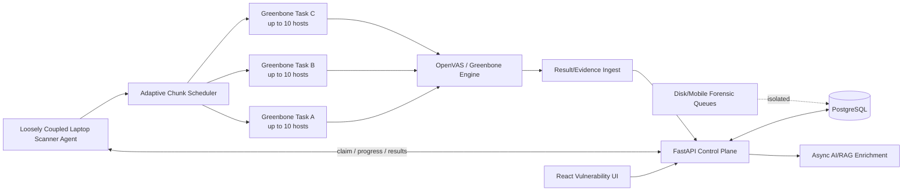

# High-Throughput Vulnerability Scanning Architecture

**Project:** Polaron + Laptop Scanner Edge Patch  
**Release:** v1.3.1 high-throughput design  
**Scope:** Vulnerability scanning only. Disk/mobile forensic extraction remains isolated.  
**Target service objective (SLO):** up to **165 IP targets/hour per suitably sized edge scanner**, subject to scan policy, target responsiveness, credentials, network latency, and scanner hardware.

> Terminology: this document treats the requested comparison to "Nexus" as a comparison to **Tenable Nessus** vulnerability scanning behavior. A fixed "Nessus takes N minutes" benchmark does not exist; scan duration depends heavily on scan policy, port range, plugins, credentials, target services, and network conditions.

---

## 1. Executive summary

The original design was spending too much time in orchestration overhead because the scanner patch primarily treated **one IP as one Greenbone/OpenVAS task**. That creates repeated target/task/report objects and limits real host fan-out. The revised design changes the unit of scheduling:

- **One central scan job** can contain 1..N IPs.
- The edge scanner divides those IPs into **bounded host chunks**.
- A small pool of **Greenbone tasks** runs concurrently.
- Each Greenbone task contains several IPs and lets OpenVAS scan those hosts concurrently.
- A typical 12+ logical CPU scanner uses **3 Greenbone tasks x 10 hosts/task = ~30 effective host slots**.
- The central server stores live **per-IP progress** independent of the Greenbone task grouping.
- The React UI shows every requested IP as **Waiting / In Progress / Completed / Fail**, with percentage and activity.
- A failure in one chunk/IP does not stop sibling chunks.
- Live progress is sent as **delta updates**, not a full 165-IP payload on every poll.
- Disk and Mobile forensic queues are not used for vulnerability execution, preventing forensic workloads from starving the scanner.
- AI/RAG are kept out of the scan hot path. They can enrich/report findings after ingestion.

This architecture is designed to improve scanner utilization and reduce orchestration overhead without intentionally dropping vulnerability evidence.

### 1.1 v1.3.1 release blockers closed

The four release-blocking issues are handled as follows:

1. **Packaging cannot replace the new scanner with the old scanner.** `scripts/pack-laptop-scanner-zip.ps1` packages only `laptop-scanner/scanner-agent`, validates the high-throughput files before packaging, and explicitly ignores the legacy repo-root `scanner-agent`.
2. **Fast policy is consistent.** The laptop `.env.example`, Docker Compose defaults, runtime `LocalOpenVAS` fallback, and generated `openvas.conf` now default to `PORT_PROFILE=fast` and `GVM_OPTIMIZE_TEST=yes`. Explicit `PORT_PROFILE=full` still means TCP 1-65535 and switches the runtime optimization behavior accordingly.
3. **Client-side OpenVAS mirrors central open-port reduction.** `agent/port_discovery.py` probes the Fast candidate TCP set concurrently, computes per-host open ports, then passes the union of discovered ports to the Greenbone target. If nothing answers, a conservative fallback range is used instead of silently dropping the target. Full-profile scans bypass this reduction.
4. **Per-IP state is persisted and rendered.** The edge agent sends `target_progress` deltas; `scanner_agent.py` accepts them; `scanner_agent_jobs.py` validates/merges them into `orchestration_json.target_progress`; `scan_orchestrator.scan_job_target_rows()` maps that state into the existing React per-IP table.

---

## 2. What was found in the two projects

### 2.1 `polaron`

The server project already has the foundations needed for a proper distributed scanner:

- `backend/app/routers/scanner_agent.py` — scanner-agent control-plane API.
- `backend/app/services/scanner_agent_jobs.py` — claim/resume/progress/result ingestion with ownership fencing.
- `backend/app/services/scan_orchestrator.py` — scan orchestration and target status composition.
- `backend/app/services/scanner_adapter.py` — scanner abstraction.
- `frontend/src/pages/vuln/ScanJobsPage.tsx` — scan-job UI.
- `frontend/src/lib/types/vuln.ts` — vulnerability UI contracts.
- Dedicated Disk/Mobile forensic task routing exists separately from vulnerability scanning.

The central orchestrator already had a `target_progress` concept for other scan paths, but the laptop-scanner path did not fully publish equivalent per-IP state.

### 2.2 `laptop-scanner`

The patch is a local Greenbone/OpenVAS edge scanner. The newer copy embedded in `polaron/laptop-scanner/scanner-agent` already contained useful capabilities:

- job ownership/recovery;
- durable per-IP audit logs;
- adaptive semaphore;
- LAN/network identity protection;
- reachability helper;
- Greenbone task/report handling;
- resume logic.

However, the performance unit was still too close to **one task per target**. The uploaded standalone scanner was older again and its scheduler was constrained to a small one-IP worker fan-out.

### 2.3 Packaging defect discovered

The PowerShell packaging script in `polaron` copied from the older root `scanner-agent` directory into the richer `laptop-scanner/scanner-agent` directory. A rebuild could therefore silently package the wrong/older agent and discard newer concurrency/recovery logic.

The packaging script is changed so that `laptop-scanner/scanner-agent` is the canonical source and required high-throughput files are validated before ZIP creation.

---

## 3. Main bottlenecks in the previous flow

### 3.1 Excessive Greenbone object/task overhead

For 165 targets, one task per IP means up to 165 cycles of:

1. create/resolve target;
2. create/resolve task;
3. start task;
4. poll task;
5. retrieve report;
6. parse results;
7. merge results;
8. update central state.

The scan engine may be able to execute many hosts concurrently, but this orchestration pattern prevents using that capacity efficiently.

### 3.2 Too few effective target slots

A scheduler limited to 5-10 one-IP tasks means only 5-10 hosts are meaningfully in flight. For 165 targets/hour:

- required throughput = `165 / 60 = 2.75 hosts/minute`;
- with 8 host slots, average slot completion must be about `60*8/165 = 2.91 minutes/host`;
- with 30 effective slots, the average wave budget becomes about `60*30/165 = 10.91 minutes`.

The second model is substantially more realistic for network vulnerability assessment.

### 3.3 Per-IP task status was not first-class in the laptop path

The server and UI could show job-level state, but an operator scanning 15/50/165 targets needs to know independently whether every IP is:

- Waiting
- In Progress
- Completed
- Fail

A job-level percentage is not enough for troubleshooting, retry, SLA measurement, or evidence traceability.

### 3.4 Reachability pre-probe could reduce evidence coverage

A quick TCP probe of a few ports is not authoritative proof that a host is offline. A live but firewalled host may answer none of the pre-probe ports. Skipping that target to gain speed can create a false sense of completion.

The default is therefore changed to **not skip** an authorized target based only on the quick pre-probe. OpenVAS remains authoritative and uses the configured alive behavior.

### 3.5 Vulnerability work must not compete with forensic pipelines

Disk extraction, Mobile extraction, OCR, RAG indexing, and report generation have very different CPU/I/O/GPU patterns. Combining them into the same work pool would make vulnerability scan completion time unpredictable.

The architecture keeps vulnerability execution at the edge and keeps forensic Celery queues logically separate.

---

## 4. Target architecture



### Design principle

**The central server knows targets and evidence; the edge scanner knows scanner mechanics.**

The API contract is scanner-neutral enough that a future Nessus/Nuclei/Qualys connector can publish the same per-IP state without the React UI knowing how Greenbone schedules tasks.

---

## 5. High-throughput scheduling model

### 5.1 Two independent concurrency limits

The new scanner separates:

1. **Task concurrency** — how many Greenbone tasks are active at once.
2. **Target concurrency** — how many IPs those tasks can collectively contain/assess.

Default high-throughput settings:

| Setting | Default | Purpose |
|---|---:|---|
| `SCAN_TASK_PARALLELISM` | `auto` | number of parallel Greenbone tasks |
| `SCAN_TASK_MAX_PARALLELISM` | `4` | hard operational cap for auto scheduler |
| `SCAN_TARGET_PARALLELISM` | `30` | desired effective simultaneous host slots |
| `SCAN_CHUNK_SIZE` | `auto` | hosts inside a Greenbone task |
| `GVM_MAX_HOSTS` | `10` | per-task OpenVAS host limit used by this package |
| `GVM_MAX_CHECKS` | `6` | plugins/checks per host target |
| `MAX_CONCURRENT_SCAN_JOBS` | `1` | keeps one 165-target central job from competing with another on one laptop |
| `SCAN_SLO_HOSTS_PER_HOUR` | `165` | telemetry objective, not a forced/unsafe guarantee |

### 5.2 Typical capacity plan

On a cool 12-15 logical CPU scanner:

- task workers = 3;
- desired target slots = 30;
- chunk size = 10;
- effective host slots = 30.

For 165 IPs:

- 17 chunks total (`16 x 10 + 1 x 5`);
- at most 3 chunks active at once;
- when one chunk finishes, the next waiting chunk is admitted immediately;
- every IP in a chunk still has independent live status in the server/UI.

### 5.3 Why not launch 30 separate OpenVAS tasks?

A large number of independent tasks creates manager/report/Redis/process overhead and may cause the scanner to spend more time context-switching and managing tasks than scanning. Multi-host tasks use OpenVAS's native host concurrency while keeping manager task fan-out bounded.

### 5.4 Adaptive throttling

`agent/capacity.py` monitors:

- CPU count;
- CPU utilization;
- load average;
- available memory;
- CPU temperature where Linux exposes it.

States:

- **cool** — use planned task/target capacity;
- **warm** — reduce admissions slightly;
- **hot** — lower task/host concurrency;
- **critical** — pause new task admissions and allow existing tasks to finish.

Existing scans are not killed just to reduce heat; doing that could lose evidence or force expensive rescans.

---

## 6. Per-IP progress/status design

### 6.1 State machine

```text
WAITING
   |
   v
IN_PROGRESS -----------------------+
   |                                |
   | scan/report succeeds           | exception/report/coverage failure
   v                                v
COMPLETED                         FAIL
```

Terminal states never regress to Waiting/In Progress for the same completed attempt.

### 6.2 Per-IP server record shape

Live target progress is carried in `orchestration_json.target_progress` to avoid a high-frequency database migration/hot-row table change in this release.

Example logical payload:

```json
{
  "10.20.0.11": {
    "status": "in_progress",
    "progress_pct": 56,
    "activity": "OpenVAS scan running",
    "task_id": "...",
    "engines": {"openvas": {"status": "running"}}
  },
  "10.20.0.12": {
    "status": "completed",
    "progress_pct": 100,
    "activity": "Completed"
  },
  "10.20.0.13": {
    "status": "failed",
    "progress_pct": 100,
    "activity": "Report verification failed",
    "error": "..."
  }
}
```

### 6.3 Trust boundary

The API does **not** blindly persist agent-provided host keys.

`_merge_edge_target_progress()`:

- normalizes addresses;
- accepts only IPs that belong to the server-side scan job;
- normalizes status aliases;
- clamps percentages to 0..100;
- bounds error/activity/task-id text sizes;
- caps engine details;
- stamps server update time.

This prevents a compromised/misconfigured edge client from adding arbitrary targets to another scan through progress telemetry.

### 6.4 Delta updates

The laptop sends the complete initial state once, then only target entries whose state changed. This avoids repeatedly transmitting 165 almost-identical objects every few seconds.

---

## 7. React UI behavior

The Scan Jobs page now presents a dedicated per-IP table.

Columns include:

- IP
- Status
- Progress
- Activity
- Critical
- High
- Medium
- Low
- Info

Status labels are normalized to the requested operator language:

- `waiting` -> **Waiting**
- `in_progress` -> **In Progress**
- `completed` -> **Completed**
- `failed` -> **Fail**

The UI also shows summary counts for in-progress/completed/failed/total targets.

The existing severity aggregation remains derived from ingested findings; progress telemetry does not manufacture finding counts.

---

## 8. Greenbone/OpenVAS execution configuration

### 8.1 Host and check concurrency

The package uses:

```env
GVM_MAX_HOSTS=10
GVM_MAX_CHECKS=6
SCAN_TARGET_PARALLELISM=30
SCAN_TASK_MAX_PARALLELISM=4
```

This means the edge scheduler controls multiple bounded tasks while OpenVAS controls plugin concurrency inside each task.

Do **not** increase every number together without measurement. More processes/sockets can make scans slower once CPU, RAM, Redis, gvmd, or the target network saturates.

### 8.2 Port profile is a major determinant of throughput

Current package default is:

```env
PORT_PROFILE=fast
PORT_DISCOVERY_ENABLED=true
GVM_OPTIMIZE_TEST=yes
```

Fast mode first discovers open ports from the bounded candidate set and gives Greenbone only that union. An explicitly selected `PORT_PROFILE=full` still performs a full TCP 1-65535 target scan and is much more expensive than the high-throughput profile. **165 hosts/hour cannot be guaranteed for arbitrary networks with a complete 65,535-port scan plus all vulnerability tests.**

For a fair Nessus-vs-OpenVAS comparison, align:

- TCP/UDP port set;
- safe checks;
- authenticated vs unauthenticated checks;
- plugin families;
- web crawling depth;
- timeouts;
- host-alive behavior;
- target network and hardware.

If business requirements permit a common-ports profile for the fast lane, create two policies:

1. **Fast Enterprise Vulnerability** — common/high-value ports, normal recurring assessment.
2. **Deep Full-Port Assessment** — 1-65535 plus extended tests, scheduled separately.

Do not silently replace the deep policy with the fast policy.

### 8.3 `optimize_test`

The package retains conservative evidence behavior rather than turning on aggressive optimizations solely to hit a time number. Any future `optimize_test=yes` change must be benchmarked for finding parity on a known vulnerable validation set.

---

## 9. Reachability policy and evidence preservation

Default:

```env
SKIP_UNREACHABLE_TARGETS=false
```

The fast socket probe can still provide telemetry, but it is not authoritative enough to remove an authorized target from assessment. This specifically protects:

- hosts with all probe ports closed;
- hosts behind filtering;
- ICMP-disabled hosts;
- devices that expose only uncommon services.

OpenVAS's configured alive handling remains the scanner-of-record decision.

---

## 10. PostgreSQL and result ingestion

### 10.1 System of record

PostgreSQL remains authoritative for:

- scan job;
- requested targets;
- ownership;
- final status;
- assets;
- findings;
- scan evidence/result summary;
- orchestration metadata.

### 10.2 No finding loss through progress optimization

Live progress and final vulnerability evidence are separate paths.

A target becoming `Completed` in progress telemetry does not itself insert or delete vulnerabilities. Final report ingestion still verifies:

- requested vs assessed host identity;
- hosts attempted/assessed;
- report ID/task ID;
- timestamps;
- plugin errors;
- result payload health;
- skipped/missing targets.

### 10.3 Resume/idempotency

The server continues to use:

- job ownership fencing;
- `FOR UPDATE SKIP LOCKED` claim behavior;
- recoverable external task IDs;
- explicit retry rules;
- single current edge evidence record per job to avoid double-counting coverage.

The edge scanner resumes a recoverable Greenbone task rather than creating duplicate work when possible.

---

## 11. Loose coupling requirements for the laptop patch

The patch must remain deployable/removable independently of the central application.

### Edge scanner owns

- Greenbone/GMP interaction;
- local scheduling;
- local resource/temperature throttling;
- local task/report IDs;
- LAN identity protection;
- per-IP operational audit log;
- result collection.

### Central Polaron owns

- authorization and target scope;
- job creation;
- user/case association;
- scanner assignment;
- progress visibility;
- result ingestion;
- evidence persistence;
- reporting.

### Communication contract

The scanner requires only HTTP API operations for:

- heartbeat/registration;
- claim next assigned job;
- patch job progress;
- upload terminal result/evidence;
- upload operational logs.

It does not import Polaron Python modules, access Polaron PostgreSQL directly, or depend on forensic queues.

---

## 12. Forensic Disk/Mobile isolation

The server has distinct task classes/queues for Disk and Mobile workflows. Vulnerability scanning should continue to avoid those queues.

Recommended deployment policy:

- Edge vulnerability laptop: Greenbone + scanner-agent only.
- Central Polaron: FastAPI/PostgreSQL/UI/control plane.
- Forensic workers: Disk/Mobile extraction and parsers.
- RAG/OCR/GPU workers: separate resource pools.

If all roles physically share a machine, use container CPU/memory limits and explicit worker queues; otherwise an active 500 GB forensic extraction can destroy the 165-IP scan SLO.

---

## 13. AI and RAG placement

AI/RAG should **not** be synchronously called for every vulnerability while the scanner is running.

Correct sequence:

1. network scan;
2. parse and normalize findings;
3. persist evidence/findings;
4. mark target/job scan state;
5. enqueue enrichment;
6. asynchronously enrich CVE/CWE/remediation/asset context;
7. create report/explanations.

This prevents an Ollama/embedding outage or slow model response from reducing scanner throughput.

---

## 14. 165-IP/hour capacity model

### 14.1 Throughput formula

A practical approximation is:

```text
host_throughput_per_hour ~= effective_host_slots * 60 / average_host_scan_minutes
```

At 30 slots:

| Average scan time/host-wave | Approx. capacity |
|---:|---:|
| 5 min | 360 hosts/hour |
| 8 min | 225 hosts/hour |
| 10 min | 180 hosts/hour |
| 10.9 min | ~165 hosts/hour |
| 15 min | 120 hosts/hour |
| 20 min | 90 hosts/hour |

This is why the architecture aims for approximately 30 effective host slots rather than 5-10.

### 14.2 Recommended edge-scanner hardware for sustained enterprise use

Starting point for the 165/h SLO:

- 12-16 logical CPU threads or better;
- 24-32 GB **available** RAM for scanner stack;
- NVMe/SSD for container/Redis/PostgreSQL/Greenbone working data;
- wired 1 GbE or better;
- scanner physically close to target network;
- no simultaneous large forensic extraction on the same host.

Hardware alone does not guarantee the SLO; target behavior and scan policy dominate many checks.

### 14.3 Horizontal scale

If one edge scanner cannot meet the measured SLO without reducing scan depth, **add scanners rather than hiding evidence**.

Example:

- Scanner A: targets 1-55
- Scanner B: targets 56-110
- Scanner C: targets 111-165

The existing central job/scanner ownership model can be extended to split an overall campaign across multiple registered edge scanners. This is the safest path to deterministic large-scale completion.

---

## 15. Benchmark procedure before production sign-off

Do not compare against Nessus using different policies.

Create one authorized test set with approximately:

- 20 Windows endpoints;
- 20 Linux endpoints;
- 10 servers with multiple services;
- 5 network devices;
- known vulnerable validation hosts in a lab;
- several firewalled/slow systems.

Run the exact same target list three times per configuration.

Capture:

- total elapsed time;
- median and p95 target completion time;
- targets/hour;
- CPU p50/p95;
- memory p50/p95;
- scanner Redis memory;
- error/timeout rate;
- targets missed;
- total findings by severity;
- CVE/plugin overlap against the baseline;
- retries/resumes;
- bytes/packets if available.

### Performance acceptance gates

1. **Coverage gate:** 100% requested authorized targets have a terminal state.
2. **Evidence gate:** no known validation finding disappears versus the agreed baseline merely because of scheduler changes.
3. **Throughput gate:** 165 targets complete in <= 60 minutes for the agreed enterprise-fast policy on the reference network/hardware.
4. **Stability gate:** no OpenVAS/gvmd/Redis OOM/restart.
5. **UI gate:** all 165 targets remain independently visible throughout the run.
6. **Resume gate:** restart the agent during a run; recoverable tasks resume and no target is duplicated into another job.
7. **Isolation gate:** Disk/Mobile worker load does not consume the edge-scanner execution pool.

If gate 3 fails but gates 1/2/4 pass, tune concurrency gradually or add scanner capacity; do not bypass gates 1/2.

---

## 16. Test cases

### Scheduler/unit tests

1. Auto capacity returns bounded task count.
2. 12-core profile calculates about 30 effective target slots.
3. Chunk size never exceeds `GVM_MAX_HOSTS` or hard safety cap.
4. Critical thermal state pauses new admissions.
5. Explicit configured limits override auto behavior within hard bounds.

### Progress contract tests

6. Initial 165 targets are `waiting`.
7. Every host inside a started chunk becomes `in_progress`.
8. Completed report hosts become `completed`/100%.
9. Chunk start/report exception marks affected targets `failed` without failing sibling chunks.
10. Server rejects progress entries for IPs outside the job.
11. Status aliases are normalized.
12. Percentages and text lengths are bounded.
13. Delta progress updates merge without removing unchanged target entries.

### Evidence tests

14. Duplicate report fetch does not duplicate findings.
15. Distinct vulnerability rows with similar summaries remain distinct.
16. Empty vulnerability list can only be called clean when host-assessment evidence is complete/valid.
17. Skipped/missing target prevents a false clean conclusion over the full requested scope.
18. Plugin warnings remain in evidence.

### Recovery tests

19. Agent restart recovers an active task ID.
20. Scanner ownership prevents a second agent instance from overwriting a running job.
21. LAN identity change invokes existing safety behavior rather than silently scanning from an unintended network.

### UI tests

22. Waiting/In Progress/Completed/Fail labels render correctly.
23. Per-IP percentage renders from 0..100.
24. Severity counts remain independent of progress telemetry.
25. Failed IP displays diagnostic activity/error.

---

## 17. Files changed in this implementation

### Edge scanner

- `laptop-scanner/scanner-agent/agent/capacity.py`
- `laptop-scanner/scanner-agent/agent/ip_semaphore.py`
- `laptop-scanner/scanner-agent/agent/main.py`
- `laptop-scanner/scanner-agent/agent/reachability.py`
- `laptop-scanner/scanner-agent/agent/gmp_local.py`
- `laptop-scanner/scanner-agent/tests/test_capacity.py`
- `laptop-scanner/scanner-agent/tests/test_target_progress.py`
- `laptop-scanner/docker-compose.yml`
- `laptop-scanner/.env.example`
- `laptop-scanner/README.md`
- `scripts/pack-laptop-scanner-zip.ps1`

### Central backend

- `backend/app/routers/scanner_agent.py`
- `backend/app/services/scanner_agent_jobs.py`
- `backend/app/services/scan_orchestrator.py`
- `backend/tests/test_scanner_agent_target_progress.py`
- target-progress assertion in `backend/tests/test_vuln_orchestrator.py`

### React frontend

- `frontend/src/lib/types/vuln.ts`
- `frontend/src/pages/vuln/ScanJobsPage.tsx`

No Disk/Mobile processing code was changed for this vulnerability-scanner performance patch.

---

## 18. Validation performed on the modified source

Scanner-agent suite:

```text
42 passed
```

New backend target-progress API test:

```text
1 passed
```

Existing targeted per-IP orchestrator test:

```text
1 passed, 30 deselected
```

`docker-compose.yml` also parses as valid YAML with the expected scanner-agent service.

A complete React production build could not be validated in the supplied extracted workspace because its frontend dependency installation is incomplete (modules such as Vite/React were unavailable). This should be run in the normal project build environment after dependency restore.

A broader existing backend test file also contains two pre-existing unrelated failures around XLSX expected columns and a missing Celery module import; those were not caused by the vulnerability progress/scheduler changes.

---

## 19. Production rollout

### Phase 1 — lab

- build scanner package v1.3.1;
- deploy on one reference scanner;
- use 15 targets;
- verify per-IP status and result parity;
- induce one failed target and one scanner restart.

### Phase 2 — controlled 50-IP benchmark

- keep `SCAN_TARGET_PARALLELISM=30`;
- monitor CPU/RAM/Redis/network;
- collect target duration distribution;
- compare findings with current production scanner.

### Phase 3 — 165-IP acceptance

- run identical scan policy and target class used for the production SLO;
- require coverage/evidence/stability gates;
- tune only one parameter at a time.

Suggested tuning order:

1. `SCAN_TARGET_PARALLELISM`: 24 -> 30 -> 36 (only on larger hardware)
2. `SCAN_TASK_MAX_PARALLELISM`: 3 -> 4
3. `GVM_MAX_HOSTS`: 8 -> 10 -> 12 (hard package cap 12)
4. `GVM_MAX_CHECKS`: 4 -> 6 -> 8 only after target/load validation

Never jump all four upward simultaneously.

### Phase 4 — production

- freeze a known-good performance profile;
- expose SLO metrics;
- alert on throughput regression, scanner pressure, task failures, missing coverage;
- maintain deep/full-port scan as a separate policy if required.

---

## 20. Recommended observability

Add/retain these metrics for each scanner instance:

- `scanner_targets_waiting`
- `scanner_targets_in_progress`
- `scanner_targets_completed`
- `scanner_targets_failed`
- `scanner_hosts_per_hour_observed`
- `scanner_active_greenbone_tasks`
- `scanner_effective_host_slots`
- `scanner_cpu_percent`
- `scanner_cpu_temp_c`
- `scanner_mem_available_gb`
- `scanner_report_parse_seconds`
- `scanner_progress_patch_latency_ms`
- `scanner_result_upload_latency_ms`
- `scanner_plugin_error_count`
- `scanner_missing_target_count`

The current patch already calculates observed terminal-host throughput during a run and compares it with `SCAN_SLO_HOSTS_PER_HOUR` for diagnostics.

---

## 21. Final architecture decision

The correct way to get closer to or better than a commercial scanner's large-target throughput is **not** to make 165 Python threads or to skip slow hosts. The scalable design is:

- small bounded Greenbone task pool;
- multi-host tasks;
- ~30 measured effective host slots on a capable scanner;
- adaptive admission control;
- per-IP status independent of task grouping;
- delta control-plane traffic;
- strict server-side target validation;
- evidence-verifying final ingestion;
- forensic/AI workloads outside the scan hot path;
- horizontal scanner scale when a single device reaches its safe resource ceiling.

That architecture raises utilization while protecting the forensic requirement that a faster scan must not silently lose targets, findings, or assessment evidence.
